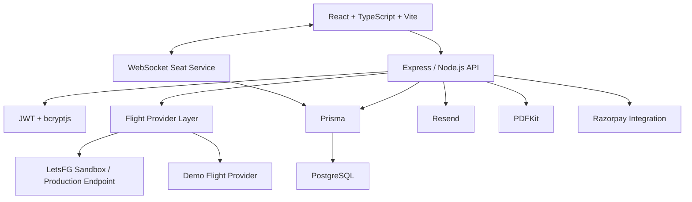
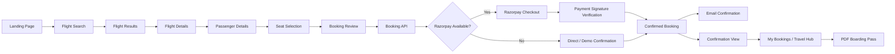
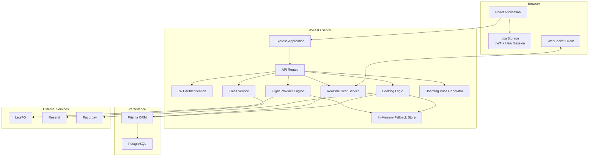
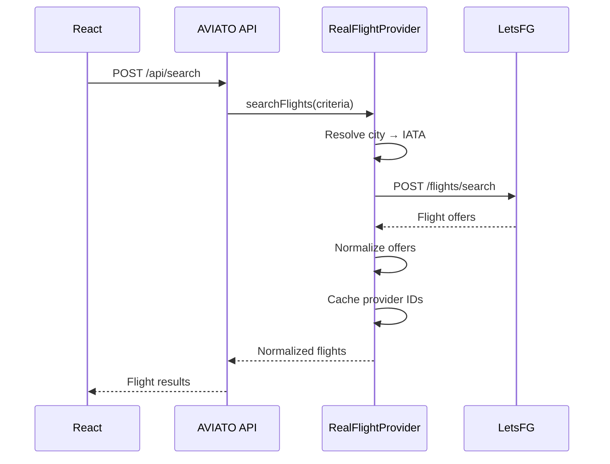
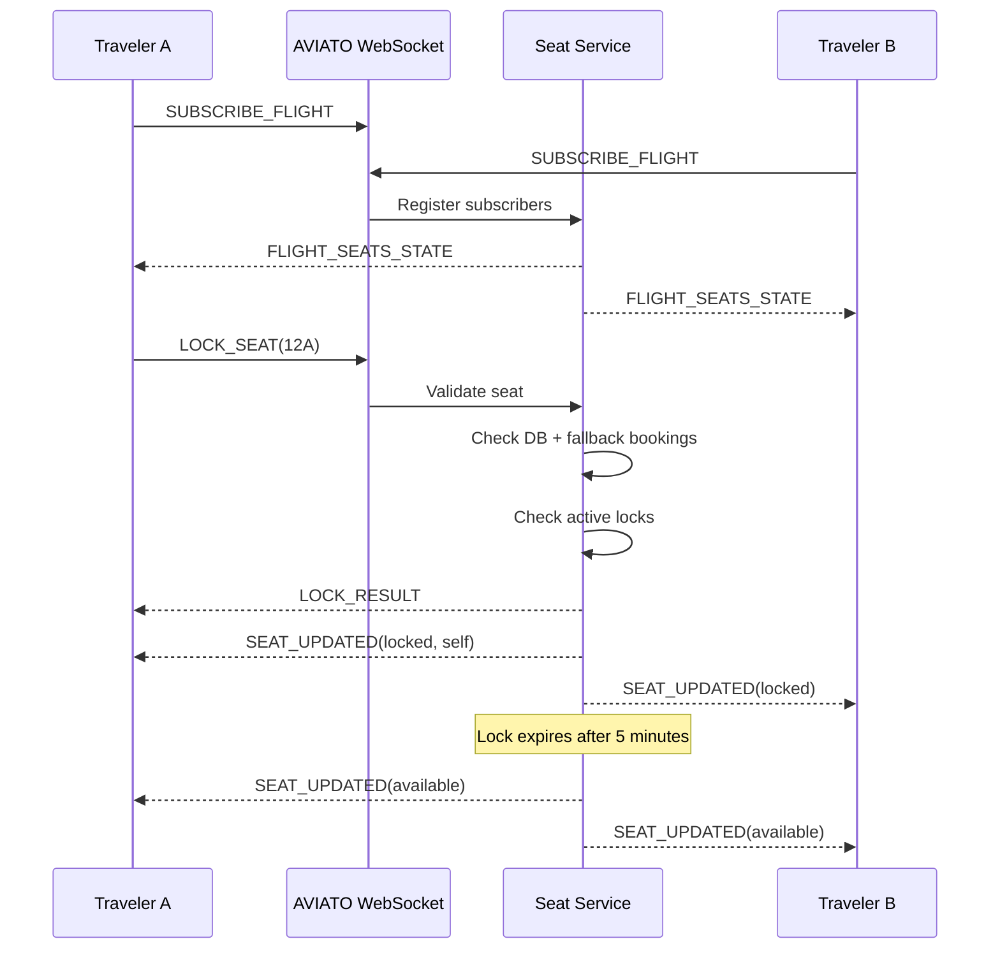
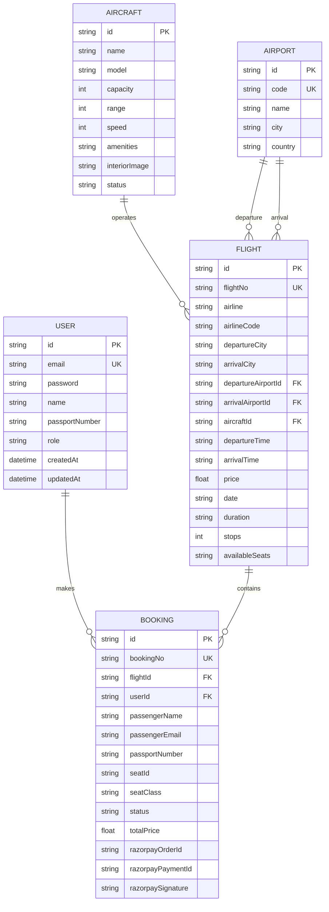
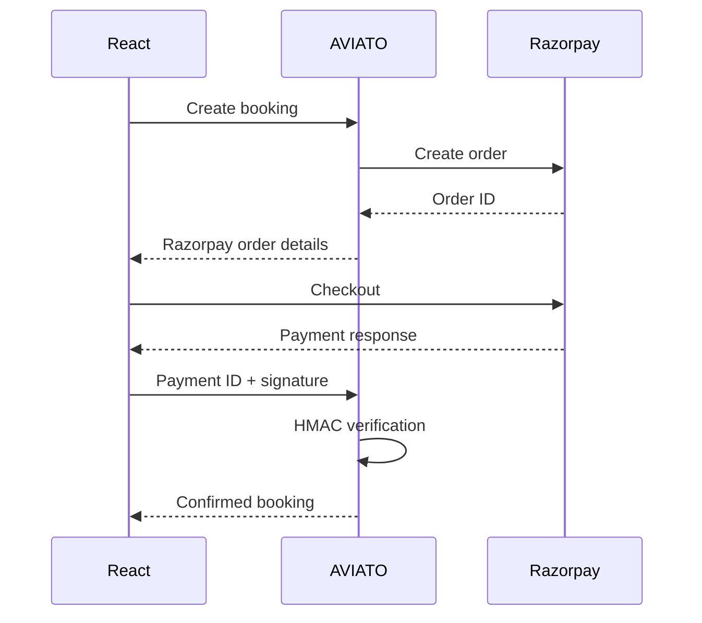
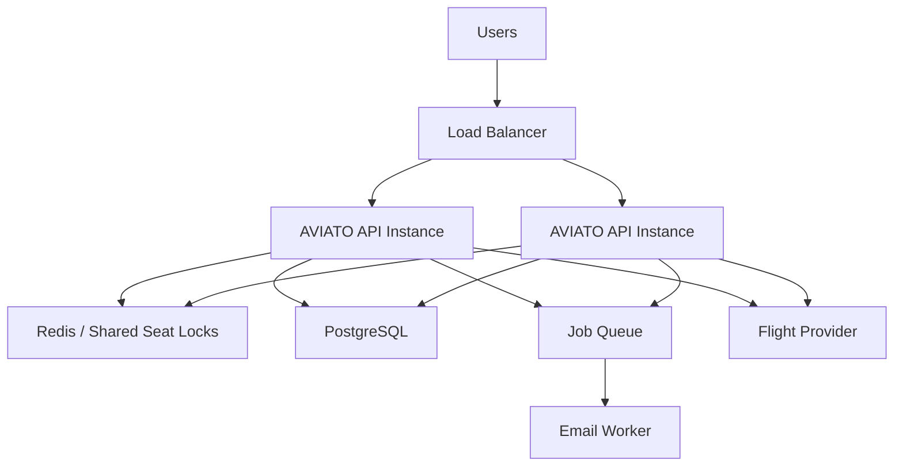

# ✈️ AVIATO

### Fly Smarter. Reach Faster.

AVIATO is a full-stack flight booking and reservation platform built as a portfolio and engineering project. It demonstrates a modern flight-search and reservation workflow across a React/TypeScript frontend, Express/Node.js backend, Prisma/PostgreSQL persistence, external flight-provider integration, real-time seat synchronization, authentication and role-based authorization, booking management, transactional email, PDF boarding-pass generation, and conditional Razorpay payment integration.

> **Important:** AVIATO is an educational/portfolio reservation simulator. It is **not an airline ticketing system**, does not issue commercially valid airline tickets, and should not be used for real-world travel transactions. External flight data is handled through the configured LetsFG environment or the application's demo fallback provider.

---

## 📋 Table of Contents

* [About AVIATO](#about-aviato)
* [Project Goal](#project-goal)
* [Problem Statement](#problem-statement)
* [Solution](#solution)
* [Key Features](#key-features)
* [Complete User Journey](#complete-user-journey)
* [System Architecture](#system-architecture)
* [Application Architecture](#application-architecture)
* [Frontend Architecture](#frontend-architecture)
* [Backend Architecture](#backend-architecture)
* [Flight Search System](#flight-search-system)
* [LetsFG Integration](#letsfg-integration)
* [Flight Data Normalization](#flight-data-normalization)
* [Real-Time Seat Availability](#real-time-seat-availability)
* [Seat Management](#seat-management)
* [Authentication](#authentication)
* [Authorization & Roles](#authorization--roles)
* [Booking System](#booking-system)
* [PNR / Booking Number](#pnr--booking-number)
* [Email System](#email-system)
* [Digital Boarding Pass](#digital-boarding-pass)
* [Customer Dashboard](#customer-dashboard)
* [Admin System](#admin-system)
* [Database Architecture](#database-architecture)
* [Database Models](#database-models)
* [Database Relationships](#database-relationships)
* [API Architecture](#api-architecture)
* [WebSocket Architecture](#websocket-architecture)
* [Failure Handling](#failure-handling)
* [Security](#security)
* [Engineering Challenges Solved](#engineering-challenges-solved)
* [Important Technical Decisions](#important-technical-decisions)
* [Tech Stack](#tech-stack)
* [Project Structure](#project-structure)
* [Environment Variables](#environment-variables)
* [Local Setup](#local-setup)
* [Available Scripts](#available-scripts)
* [Testing / Verification](#testing--verification)
* [Current Project Status](#current-project-status)
* [Payment Architecture](#payment-architecture)
* [Future Scope](#future-scope)
* [Scalability](#scalability)
* [Engineering Concepts Demonstrated](#engineering-concepts-demonstrated)
* [Screenshots](#screenshots)
* [Documentation](#documentation)
* [Author](#author)
* [Repository](#repository)
* [Security Notice](#security-notice)
* [Disclaimer](#disclaimer)

---

# About AVIATO

AVIATO models the engineering challenges behind a modern flight-reservation workflow rather than functioning as a simple CRUD application.

The application combines:

* Flight search and filtering
* External flight-provider integration
* Demo flight fallback
* Flight-offer normalization
* Authentication
* JWT-based sessions
* Password hashing
* Customer and administrator roles
* Seat-map generation
* Real-time seat locking
* WebSocket synchronization
* Server-side seat validation
* Booking persistence
* PNR-style booking references
* Customer booking history
* Booking cancellation and rebooking
* Transactional confirmation email
* PDF boarding-pass generation
* Administrative dashboards
* Aircraft management
* PostgreSQL persistence through Prisma
* In-memory resilience when the database is unavailable
* Conditional Razorpay payment-order creation and signature verification

The project therefore demonstrates interaction between multiple application layers instead of treating the frontend, backend, database, and integrations as isolated components.

---

# Project Goal

The primary engineering objective of AVIATO is to demonstrate how a reservation workflow can be designed when several independent systems have to cooperate.

The project focuses particularly on problems such as:

1. Integrating an external flight provider without exposing API credentials to the browser.
2. Converting provider-specific flight responses into a stable internal format.
3. Keeping seat availability synchronized between multiple clients.
4. Preventing two users from selecting the same seat.
5. Persisting bookings while retaining an in-memory fallback mode.
6. Protecting authenticated resources with JWTs.
7. Separating customer functionality from administrative functionality.
8. Generating reservation documents and confirmation emails.
9. Handling external API, database, payment, and email failures without unnecessarily crashing the application.
10. Keeping the frontend independent from the provider-specific response format.

---

# Problem Statement

A flight reservation workflow contains several stateful operations that cannot safely be treated as independent frontend actions.

For example:

```text
Search Flight
     ↓
Select Offer
     ↓
Select Seat
     ↓
Hold Seat
     ↓
Enter Passenger Details
     ↓
Validate Availability
     ↓
Create Booking
     ↓
Payment / Confirmation
     ↓
Generate Reservation Information
     ↓
Email Confirmation
     ↓
Boarding Pass
```

Several problems appear in this workflow:

### External provider dependency

Flight information may come from an external API whose response format is different from the application's internal model.

### Concurrent seat selection

Two clients may attempt to select the same seat at approximately the same time.

### Database availability

A reservation application should not assume that its database is always reachable.

### Authentication state

Users need persistent authenticated sessions while protected resources must remain inaccessible to unauthenticated users.

### Authorization

Administrative operations such as user management and aircraft management should not be available to normal customers.

### Payment state

A booking can involve an external payment gateway and therefore requires handling pending orders, payment verification, and failure states.

### Communication

Booking confirmation needs to be communicated to the passenger independently of the browser UI.

AVIATO addresses these problems through explicit backend services, provider abstraction, server-side validation, real-time seat state, and fallback mechanisms.

---

# Solution

AVIATO uses a layered architecture:



The external flight provider is accessed server-side. The browser communicates with AVIATO's backend rather than receiving the LetsFG API key.

---

# Key Features

## ✈️ Flight Search

* Search by origin and destination.
* Date validation.
* Passenger-count validation.
* Cabin-class support.
* City-to-IATA resolution.
* LetsFG integration.
* Demo flight fallback.
* Flight-offer normalization.
* Provider metadata preservation.
* Cached provider offer identifiers.
* Flight-offer expiry handling.

## 💺 Real-Time Seat Selection

* Full cabin seat generation.
* Seat classes.
* Available/booked/locked/selected states.
* Five-minute seat holds.
* Session-specific locks.
* WebSocket broadcasting.
* REST seat-state fallback.
* Server-side availability validation.

## 🔐 Authentication

* Signup.
* Login.
* bcrypt password hashing.
* JWT authentication.
* Persistent browser session through local storage.
* `/api/auth/me` session verification.
* Profile updates.

## 👥 Authorization

Two roles are represented:

```text
CUSTOMER
ADMIN
```

Administrative endpoints use JWT authentication together with role checking.

## 🧾 Booking

* Passenger information.
* Seat selection.
* Server-side seat validation.
* Authoritative price calculation.
* Booking-number generation.
* Database persistence.
* In-memory fallback.
* Booking history.
* Cancellation.
* Rebooking.

## 💳 Payment Integration

Razorpay support exists conditionally.

When valid Razorpay credentials are available and the gateway probe succeeds, AVIATO can:

1. Create a Razorpay order.
2. Return the order information to the frontend.
3. Open Razorpay Checkout.
4. Receive the payment response.
5. Verify the Razorpay signature server-side.
6. Mark the booking as confirmed.

When the gateway is unavailable, the application's booking flow can fall back to its direct/demo confirmation behavior.

This does **not** constitute production payment processing.

## 📧 Email

AVIATO integrates directly with the Resend email API for booking-confirmation emails.

Email delivery failure does not automatically invalidate an otherwise created booking.

## 🎫 Boarding Pass

The backend generates a PDF boarding-pass-style document using PDFKit.

The generated document explicitly identifies itself as a demo/simulation boarding pass.

## 🛠️ Admin Portal

Administrators can access:

* Dashboard statistics
* User management
* User role editing
* User deletion
* Aircraft management
* Aircraft creation
* Aircraft updates
* Aircraft decommissioning

---

# Complete User Journey

The implemented application flow can be represented as:



### 1. Search

The frontend submits search criteria to the backend.

AVIATO accepts `/api/search` as the frontend-compatible search endpoint and also exposes `/api/flights/search`.

### 2. Flight Results

The provider layer returns normalized flight objects.

Depending on configuration, the result can originate from:

* LetsFG
* Demo provider

### 3. Flight Details

The selected flight is carried into the booking workflow.

### 4. Passenger Details

The user provides:

* Passenger name
* Passenger email
* Passport/ID information

### 5. Seat Selection

The user selects a seat from the generated cabin layout.

AVIATO uses both REST and WebSocket mechanisms for live seat state.

### 6. Booking

The backend validates:

* Flight existence
* Seat format
* Seat availability
* Existing bookings
* Authoritative pricing

### 7. Booking Number

A booking reference is generated in the form:

```text
AV-123456
```

### 8. Payment

If the Razorpay gateway is configured and verified, the frontend receives a Razorpay order and launches checkout.

Otherwise the application can proceed through its non-payment/demo confirmation path.

### 9. Confirmation

The reservation is displayed in the confirmation view and added to the user's booking state.

### 10. Email

For confirmed reservations, AVIATO attempts to send a booking-confirmation email through Resend.

### 11. Boarding Pass

The user can request a server-generated PDF boarding pass from the booking interface.

### 12. Dashboard

The Travel Hub provides booking history, upcoming trips, profile access, and reservation management.

---

# System Architecture



---

# Application Architecture

AVIATO is organized into several logical layers.

| Layer              | Responsibility                                                  |
| ------------------ | --------------------------------------------------------------- |
| React UI           | User interaction and presentation                               |
| Frontend utilities | API interception, currency formatting, pricing, ticket fallback |
| Express            | HTTP API and server orchestration                               |
| Routes             | Authentication, flights, bookings, seats, aircraft, admin       |
| Services           | Flight providers, email, real-time seats                        |
| Middleware         | Authentication and booking logging                              |
| Prisma             | Database access                                                 |
| PostgreSQL         | Persistent relational storage                                   |
| Fallback store     | In-memory resilience and demo data                              |
| External APIs      | LetsFG, Resend, Razorpay                                        |

---

# Frontend Architecture

The frontend is implemented with:

* React
* TypeScript
* Vite
* Tailwind CSS
* Lucide React
* Motion
* Recharts

The application is primarily orchestrated through `src/App.tsx`.

## Major Pages

```text
src/pages/
├── AdminDashboardPage.tsx
├── FlightDetailsPage.tsx
├── LandingPage.tsx
├── LoginPage.tsx
├── MyProfilePage.tsx
├── SearchResultsPage.tsx
├── SignupPage.tsx
└── TravelHubPage.tsx
```

## Major Components

```text
src/components/
├── AuthForm.tsx
├── BookingCard.tsx
├── BookingConfirmationView.tsx
├── BookingFlightSummary.tsx
├── BookingProgressBar.tsx
├── BookingReviewStep.tsx
├── DashboardCard.tsx
├── DiagnosticsConsole.tsx
├── FlightCard.tsx
├── Footer.tsx
├── Navbar.tsx
├── PassengerDetailsStep.tsx
├── SearchForm.tsx
├── SeatSelector.tsx
└── Sidebar.tsx
```

## Booking UI State

The frontend maintains explicit states for:

* Selected flight
* Available seats
* Selected seat
* Passenger information
* Promo code
* Checkout step
* Payment processing
* Recent booking
* Email confirmation status
* Current application view

The application uses a view-based navigation model rather than a separate client-side routing library.

---

# Backend Architecture

The backend is a unified Node.js process built around Express.

The same server handles:

* API requests
* Vite development middleware
* Production static files
* WebSocket upgrades
* Database initialization

The server listens on:

```text
0.0.0.0:3000
```

## Backend modules

```text
server/
├── routes/
├── services/
├── middleware/
├── utils/
├── db.ts
├── fallbackStore.ts
└── seed.ts
```

### Routes

* `auth.ts`
* `flights.ts`
* `seats.ts`
* `bookings.ts`
* `aircraft.ts`
* `admin.ts`

### Services

* Flight-provider abstraction
* LetsFG provider
* Demo provider
* Flight normalization
* Real-time seat service
* Email service

### Utilities

* Seat normalization
* Pricing
* Currency handling

---

# Flight Search System

Flight search is implemented through a provider abstraction.

```text
IFlightProvider
       │
       ├── RealFlightProvider
       │        │
       │        └── LetsFG API
       │
       └── DemoFlightProvider
```

The active provider is selected through:

```text
FLIGHT_PROVIDER_MODE
```

or:

```text
LETSFG_MODE
```

The default mode is:

```text
letsfg_sandbox
```

Explicit demo mode is also supported.

## Search Validation

The backend validates:

* Origin presence
* Destination presence
* Origin and destination cannot be identical
* Passenger count between 1 and 9
* Date format
* Date cannot be in the past

## City-to-IATA Resolution

AVIATO contains mappings for several major locations, including:

```text
Delhi       → DEL
Mumbai      → BOM
Bangalore   → BLR
Goa         → GOI
Hyderabad   → HYD
Chennai     → MAA
Kolkata     → CCU
Dubai       → DXB
London      → LHR
New York    → JFK
Singapore   → SIN
```

Unknown inputs are also handled through airport/fallback resolution logic.

---

# LetsFG Integration

AVIATO contains a server-side LetsFG flight-provider integration.

The API key is read from:

```text
LETSFG_API_KEY
```

The key is not intentionally exposed to the frontend.

## Provider Modes

The provider supports:

```text
demo
letsfg_sandbox
letsfg_production
```

The default mode is:

```text
letsfg_sandbox
```

### Sandbox endpoint

The implementation uses the LetsFG sandbox flight-search endpoint by default.

Production mode switches the provider base path to the production API.

## Request Flow



## Authentication

LetsFG requests use:

```text
X-API-Key: <server-side key>
```

The credential is obtained from the server environment.

## Timeout Handling

The provider uses a 12-second abort timeout for the flight search request.

## Error Handling

The provider explicitly handles:

| Condition                       | Behavior            |
| ------------------------------- | ------------------- |
| Missing API key                 | Demo fallback       |
| Demo mode                       | Demo provider       |
| HTTP 401/403                    | Demo fallback       |
| HTTP 402                        | Demo fallback       |
| HTTP 429                        | Demo fallback       |
| Other non-success response      | Demo fallback       |
| Malformed JSON                  | Demo fallback       |
| Network failure                 | Demo fallback       |
| Request timeout                 | Demo fallback       |
| Valid response with zero offers | Return zero results |

Importantly, a genuine zero-result LetsFG response does **not** automatically generate fake flights.

---

# Flight Data Normalization

External flight data is converted into AVIATO's internal flight representation through the flight adapter.

The adapter handles concepts including:

* Airport resolution
* Flight time formatting
* Flight date extraction
* Duration calculation
* ISO duration parsing
* Currency conversion
* Provider offer normalization

LetsFG-specific data is normalized through:

```text
normalizeLetsFGFlightOffer()
```

The normalized object can preserve provider-specific information such as:

```text
providerSource
providerOfferId
offerId
searchId
originalPrice
originalCurrency
expiresAt
rawProviderPayload
```

This allows the frontend and booking layer to work with a consistent model while retaining information required for provider-aware workflows.

---

# Real-Time Seat Availability

Real-time seat availability is one of AVIATO's major engineering features.

The backend uses the `ws` WebSocket library.

WebSocket connections are accepted on:

```text
/ws
/api/ws
```

## Seat State

A seat can exist in states such as:

```text
available
locked
booked
selected
```

The authoritative backend state distinguishes:

* Permanently booked seats
* Temporarily locked seats
* The current user's own lock

## Five-Minute Holds

Seat locks use:

```text
5 minutes
```

The server periodically removes expired locks.

When a lock expires, an availability update is broadcast to subscribed clients.

---

# WebSocket Architecture



## Supported WebSocket Events

### Client → Server

```text
SUBSCRIBE_FLIGHT
UNSUBSCRIBE_FLIGHT
LOCK_SEAT
UNLOCK_SEAT
PING
```

### Server → Client

```text
FLIGHT_SEATS_STATE
LOCK_RESULT
SEAT_UPDATED
PONG
```

## Subscriber Management

The server maintains:

```text
flightSubscribers
```

which maps each flight ID to its connected WebSocket clients.

A client subscribes to a particular flight and receives state changes for that flight.

---

# Seat Management

Seat management is implemented in:

```text
server/utils/seats.ts
server/services/realtimeSeats.ts
server/routes/seats.ts
```

## Seat Generation

AVIATO generates a full cabin layout with first, business, and economy sections.

Seats are represented using identifiers such as:

```text
1A
1B
1C
...
```

## Seat Normalization

Seat identifiers are normalized before comparison.

This prevents logically equivalent representations from being treated as different seats.

## Booking Validation

Before creating a reservation, the backend checks:

1. The flight exists.
2. The seat is valid.
3. The seat is not already booked.
4. The seat exists in the flight's availability list.
5. Existing bookings are considered.
6. Active fallback bookings are considered.

## Concurrent Users

Temporary seat locks are held in an in-memory map:

```text
flightId:seatId → SeatLock
```

A lock contains:

```text
flightId
seatId
sessionId
lockedAt
expiresAt
```

A user can hold one active seat for a flight; selecting another seat releases the previous lock.

## Important Limitation

The active lock map is process-local memory.

For a horizontally scaled production deployment, these locks would need to move to shared infrastructure such as Redis or another distributed coordination mechanism.

---

# Authentication

Authentication is implemented using:

* bcryptjs
* JSON Web Tokens
* Express middleware

## Signup

The signup endpoint:

```text
POST /api/auth/signup
```

creates a customer account and hashes the password before persistence.

New accounts default to:

```text
CUSTOMER
```

## Login

The login endpoint:

```text
POST /api/auth/login
```

validates the supplied password using bcrypt and returns an authenticated JWT payload.

## JWT

Protected requests use:

```http
Authorization: Bearer <token>
```

The JWT contains user identity information including:

```text
id
email
name
role
```

## Session Persistence

The frontend stores the token in:

```text
localStorage
```

and verifies it against:

```text
GET /api/auth/me
```

when the application loads.

An invalid session clears the locally stored authentication state.

---

# Authorization & Roles

AVIATO uses two application roles:

| Role       | Description               |
| ---------- | ------------------------- |
| `CUSTOMER` | Standard traveler account |
| `ADMIN`    | Administrative account    |

The backend implements role authorization through:

```text
requireRole()
```

For example:

```text
authenticateJWT
      ↓
requireRole(["ADMIN"])
      ↓
Administrative endpoint
```

Administrative operations include:

* Dashboard statistics
* User listing
* User editing
* User deletion
* Aircraft creation
* Aircraft editing
* Aircraft deletion
* Flight administration

The server, rather than the frontend alone, enforces the role requirement.

---

# Booking System

The booking flow contains server-side validation instead of trusting the price and seat state supplied by the browser.

## Booking Request

The frontend sends information including:

```text
flightId
passengerName
passengerEmail
passportNumber
seatId
seatClass
totalPrice
```

The backend then:

1. Resolves the flight.
2. Checks database availability.
3. Checks provider-cached flight data.
4. Checks fallback flight data.
5. Normalizes the requested seat.
6. Checks existing bookings.
7. Checks seat availability.
8. Removes the seat from available inventory.
9. Calculates an authoritative price.
10. Generates a booking number.
11. Persists the booking.
12. Confirms the seat in the real-time seat service.
13. Optionally creates a Razorpay order.
14. Sends confirmation email when appropriate.

## Authoritative Pricing

The backend does not blindly trust the frontend's displayed total.

The server recalculates pricing based on the flight and seat characteristics.

Seat-related pricing includes modifiers for cabin/seat categories and window seats.

A first-time promotional discount can also be recognized when the supplied total corresponds to the expected discounted amount.

---

# PNR / Booking Number

AVIATO generates reservation references using the following format:

```text
AV-XXXXXX
```

For example:

```text
AV-104921
```

The generated value is stored as the booking's:

```text
bookingNo
```

and is used in reservation displays, confirmation emails, and boarding-pass documents.

The current implementation uses random six-digit generation rather than an externally issued airline PNR service.

Therefore these identifiers should be understood as **AVIATO demo booking references**, not airline-issued PNRs.

---

# Email System

AVIATO integrates directly with Resend through its HTTP API.

Environment variables:

```text
EMAIL_API_KEY
EMAIL_FROM
```

The email service sends booking-confirmation messages containing information such as:

* Booking reference
* Passenger name
* Flight number
* Airline
* Route
* Departure date
* Departure time
* Arrival time
* Aircraft
* Cabin class
* Seat
* Fare

The service returns a success/failure result rather than causing the reservation itself to fail automatically.

This means:

```text
Booking succeeds
      │
      ├── Email succeeds → Confirmation delivered
      │
      └── Email fails → Booking remains recorded
```

---

# Digital Boarding Pass

AVIATO provides a server-side boarding-pass endpoint:

```text
GET /api/bookings/:id/boarding-pass
```

The backend uses:

```text
PDFKit
```

to generate a PDF document.

The generated document contains information including:

* AVIATO branding
* Demo environment indicator
* Passenger
* Airline
* Flight number
* Origin
* Destination
* Departure
* Arrival
* Date
* Seat
* Class
* Booking reference
* Flight duration
* Stop information

The document explicitly states that it is a demonstration boarding pass and not an airline ticket.

The frontend also contains a fallback HTML e-ticket generator if the server PDF endpoint is unavailable.

---

# Customer Dashboard

The Travel Hub is the main authenticated traveler area.

It provides access to:

* Upcoming flights
* Past flights
* Booking records
* Booking status
* Booking details
* Profile
* Profile editing
* Quick flight search
* Booking cancellation
* Boarding-pass download

Bookings are divided into upcoming and past reservations based on flight date.

---

# Admin System

The administrative interface is implemented through:

```text
src/pages/AdminDashboardPage.tsx
server/routes/admin.ts
server/routes/aircraft.ts
```

## Dashboard Statistics

The admin dashboard can expose statistics such as:

* Total users
* Total flights
* Total bookings
* Revenue
* Booking trends

## User Management

Administrators can:

* View users
* Edit user details
* Change roles
* Update passport information
* Delete users

The backend prevents deletion of the sole remaining administrator account.

## Aircraft Management

Administrators can:

* Create aircraft
* Update aircraft specifications
* Decommission aircraft

Aircraft fields include:

* Name
* Model
* Capacity
* Range
* Speed
* Amenities
* Interior image
* Status

Aircraft statuses represented by the schema include:

```text
ACTIVE
MAINTENANCE
STANDBY
```

---

# Database Architecture

AVIATO uses:

```text
PostgreSQL
      ↑
Prisma ORM
      ↑
Express Services / Routes
```

The Prisma datasource is configured for PostgreSQL.

The application also contains an in-memory fallback architecture for cases where the configured database is unavailable.

## Database Health

AVIATO performs a database connectivity check using Prisma.

The application can expose database diagnostics through:

```text
GET /api/debug/db-status
```

The diagnostics report whether the database is currently available and can provide counts for:

* Flights
* Bookings
* Aircraft
* Airports

---

# Database Models

The Prisma schema defines five primary models.

## User

Purpose:

Represents an AVIATO account.

Important fields:

| Field            | Purpose                |
| ---------------- | ---------------------- |
| `id`             | UUID identifier        |
| `email`          | Unique account email   |
| `password`       | Hashed password        |
| `name`           | Traveler name          |
| `passportNumber` | Optional passport/ID   |
| `role`           | `CUSTOMER` or `ADMIN`  |
| `createdAt`      | Creation timestamp     |
| `updatedAt`      | Modification timestamp |

Relationships:

```text
User 1 ─── * Booking
```

---

## Aircraft

Purpose:

Represents an aircraft in the AVIATO fleet.

Important fields:

| Field           | Purpose                     |
| --------------- | --------------------------- |
| `id`            | UUID                        |
| `name`          | Aircraft name               |
| `model`         | Aircraft model              |
| `capacity`      | Passenger capacity          |
| `range`         | Range in km                 |
| `speed`         | Speed in km/h               |
| `amenities`     | Stored amenities            |
| `interiorImage` | Aircraft image              |
| `status`        | Aircraft operational status |
| `createdAt`     | Creation timestamp          |
| `updatedAt`     | Modification timestamp      |

Relationship:

```text
Aircraft 1 ─── * Flight
```

---

## Airport

Purpose:

Represents a flight airport.

Important fields:

| Field       | Purpose                |
| ----------- | ---------------------- |
| `id`        | UUID                   |
| `code`      | Unique airport code    |
| `name`      | Airport name           |
| `city`      | City                   |
| `country`   | Country                |
| `createdAt` | Creation timestamp     |
| `updatedAt` | Modification timestamp |

Relationships:

```text
Airport 1 ─── * Flight (departure)
Airport 1 ─── * Flight (arrival)
```

The two relationships use separate Prisma relation names:

```text
DepartureAirport
ArrivalAirport
```

---

## Flight

Purpose:

Represents a searchable/reservable flight.

Important fields include:

| Field                | Purpose                |
| -------------------- | ---------------------- |
| `id`                 | Flight identifier      |
| `flightNo`           | Unique flight number   |
| `airline`            | Airline name           |
| `airlineCode`        | Airline code           |
| `departureCity`      | Origin city            |
| `arrivalCity`        | Destination city       |
| `departureAirportId` | Origin airport         |
| `arrivalAirportId`   | Destination airport    |
| `departureTime`      | Departure              |
| `arrivalTime`        | Arrival                |
| `price`              | Base flight fare       |
| `date`               | Flight date            |
| `duration`           | Duration               |
| `cabinClass`         | Cabin category         |
| `stops`              | Number of stops        |
| `aircraftId`         | Aircraft relationship  |
| `availableSeats`     | Seat inventory         |
| `createdAt`          | Creation timestamp     |
| `updatedAt`          | Modification timestamp |

Relationships:

```text
Flight * ─── 1 Airport
Flight * ─── 1 Airport
Flight * ─── 1 Aircraft
Flight 1 ─── * Booking
```

---

## Booking

Purpose:

Represents a reservation.

Important fields:

| Field               | Purpose                         |
| ------------------- | ------------------------------- |
| `id`                | Booking identifier              |
| `bookingNo`         | Unique AVIATO booking reference |
| `flightId`          | Reserved flight                 |
| `userId`            | Optional associated user        |
| `passengerName`     | Passenger                       |
| `passengerEmail`    | Passenger email                 |
| `passportNumber`    | Passenger passport/ID           |
| `seatId`            | Selected seat                   |
| `seatClass`         | Cabin/seat class                |
| `status`            | Booking state                   |
| `totalPrice`        | Reservation total               |
| `razorpayOrderId`   | Optional Razorpay order         |
| `razorpayPaymentId` | Optional payment ID             |
| `razorpaySignature` | Optional signature              |
| `createdAt`         | Creation timestamp              |
| `updatedAt`         | Modification timestamp          |

Relationships:

```text
Booking * ─── 1 User
Booking * ─── 1 Flight
```

---

# Database Relationships



---

# API Architecture

The application exposes both primary route modules and compatibility endpoints.

## Authentication

| Method | Endpoint           | Auth   | Purpose        |
| ------ | ------------------ | ------ | -------------- |
| POST   | `/api/auth/signup` | Public | Register       |
| POST   | `/api/auth/login`  | Public | Login          |
| GET    | `/api/auth/me`     | JWT    | Current user   |
| PUT    | `/api/auth/me`     | JWT    | Update profile |

---

## Flights

| Method | Endpoint                       | Auth   | Purpose                        |
| ------ | ------------------------------ | ------ | ------------------------------ |
| GET    | `/api/flights`                 | Public | List flights                   |
| POST   | `/api/flights/search`          | Public | Search flights                 |
| POST   | `/api/search`                  | Public | Compatibility search endpoint  |
| GET    | `/api/flights/config`          | Public | Flight configuration           |
| GET    | `/api/flights/health`          | Public | Provider-related health/config |
| GET    | `/api/flights/provider-status` | Public | Provider status                |
| GET    | `/api/flights/:id`             | Public | Flight details                 |
| POST   | `/api/flights`                 | Admin  | Create flight                  |
| PUT    | `/api/flights/:id`             | Admin  | Update flight                  |
| DELETE | `/api/flights/:id`             | Admin  | Delete flight                  |

---

## Seat Availability

| Method | Endpoint                              | Auth   | Purpose            |
| ------ | ------------------------------------- | ------ | ------------------ |
| GET    | `/api/flights/:flightId/seats`        | Public | Current seat state |
| POST   | `/api/flights/:flightId/seats/lock`   | Public | Hold seat          |
| POST   | `/api/flights/:flightId/seats/unlock` | Public | Release hold       |

The current seat-lock endpoints use a client-generated session identifier rather than JWT authentication.

---

## Bookings

| Method | Endpoint                          | Auth           | Purpose                 |
| ------ | --------------------------------- | -------------- | ----------------------- |
| POST   | `/api/book`                       | Token optional | Create reservation      |
| POST   | `/api/book/verify`                | Token optional | Verify Razorpay payment |
| GET    | `/api/bookings`                   | Token-aware    | Booking history         |
| GET    | `/api/bookings/:id`               | Token-aware    | Booking details         |
| POST   | `/api/bookings/:id/cancel`        | JWT            | Cancel booking          |
| POST   | `/api/bookings/:id/rebook`        | JWT            | Rebook                  |
| GET    | `/api/bookings/:id/boarding-pass` | Optional JWT   | PDF boarding pass       |

The repository also contains a more fully authenticated booking router mounted at `/api/bookings`. The frontend's active purchase flow uses the compatibility `/api/book` endpoints in `server.ts`.

---

## Aircraft

| Method | Endpoint            | Auth   | Purpose               |
| ------ | ------------------- | ------ | --------------------- |
| GET    | `/api/aircraft`     | Public | List aircraft         |
| GET    | `/api/aircraft/:id` | Public | Aircraft details      |
| POST   | `/api/aircraft`     | Admin  | Create aircraft       |
| PUT    | `/api/aircraft/:id` | Admin  | Update aircraft       |
| DELETE | `/api/aircraft/:id` | Admin  | Decommission aircraft |

---

## Admin

| Method | Endpoint                     | Auth  | Purpose              |
| ------ | ---------------------------- | ----- | -------------------- |
| GET    | `/api/admin/dashboard-stats` | Admin | Dashboard statistics |
| GET    | `/api/admin/users`           | Admin | List users           |
| PUT    | `/api/admin/users/:id`       | Admin | Edit user            |
| DELETE | `/api/admin/users/:id`       | Admin | Delete user          |

---

## Diagnostics

| Method | Endpoint                          | Purpose                   |
| ------ | --------------------------------- | ------------------------- |
| GET    | `/health`                         | Server health             |
| GET    | `/api/health`                     | API health                |
| GET    | `/api/debug/db-status`            | Database diagnostics      |
| GET    | `/api/flight-provider/status`     | Provider configuration    |
| GET    | `/api/flight-provider/diagnostic` | LetsFG diagnostic request |
| POST   | `/api/test-email`                 | Email testing endpoint    |

---

# WebSocket Architecture

WebSocket upgrades are handled by the same HTTP server used by Express.

Supported paths:

```text
/ws
/api/ws
```

A client subscribes using:

```json
{
  "type": "SUBSCRIBE_FLIGHT",
  "flightId": "flight-id",
  "sessionId": "session-id"
}
```

A seat lock request uses:

```json
{
  "type": "LOCK_SEAT",
  "flightId": "flight-id",
  "seatId": "12A",
  "sessionId": "session-id"
}
```

The service broadcasts state changes to clients subscribed to that flight.

---

# Failure Handling

AVIATO contains several resilience mechanisms.

## LetsFG Failure

The provider falls back to demo flights when:

* API key is missing
* Authentication fails
* Account tier blocks the request
* Rate limits are reached
* Server errors occur
* JSON is malformed
* Network requests fail
* Requests time out

A valid zero-result response remains a zero-result response.

---

## Database Failure

The application checks database availability.

When PostgreSQL/Prisma is unavailable, several workflows use the in-memory fallback store.

The fallback store contains:

* Users
* Flights
* Bookings
* Aircraft

This allows the application to continue demonstrating the booking workflow without an active database connection.

However, in-memory records are process-local and should not be treated as durable production persistence.

---

## Authentication Failure

Invalid or expired JWTs produce authentication failures on protected endpoints.

The frontend also clears its stored session when `/api/auth/me` reports an invalid session.

---

## Seat Conflict

Seat availability is checked server-side.

If a seat is already booked or held, the backend can return a conflict/error response instead of trusting the frontend selection.

---

## Email Failure

Email delivery is deliberately treated separately from booking persistence.

A failed Resend request produces an email failure result but does not automatically roll back the booking.

---

## Payment Failure

Razorpay configuration is verified before the payment flow is enabled.

If gateway verification fails, AVIATO can fall back to its non-Razorpay confirmation behavior.

---

# Security

The repository implements several security-related practices.

## Password Hashing

Passwords are hashed with:

```text
bcryptjs
```

before database persistence.

## JWT Authentication

Protected APIs validate bearer tokens with:

```text
jsonwebtoken
```

## Role Authorization

Administrative routes require:

```text
authenticateJWT
+
requireRole(["ADMIN"])
```

## Server-Side Provider Credentials

LetsFG credentials are read from server environment variables.

The API key is not intended to be exposed to browser code.

## Environment Variables

Sensitive configuration is intended to be stored in environment variables rather than committed source code.

## Input Validation

The backend validates important booking/search inputs including:

* Required passenger data
* Flight ID
* Seat ID
* Passenger count
* Search date
* Origin/destination
* Role requirements

## Logging

The server contains request/response logging and masks selected sensitive request fields such as:

```text
password
passportNumber
```

when logging request bodies.

---

# Engineering Challenges Solved

## 1. External Flight Provider Abstraction

### Problem

Frontend and booking logic should not depend directly on a provider-specific response format.

### Approach

AVIATO introduces:

```text
IFlightProvider
```

and provider implementations.

### Implementation

```text
IFlightProvider
    ├── RealFlightProvider
    │       └── LetsFG
    └── DemoFlightProvider
```

### Engineering Concept

**Provider abstraction and dependency isolation.**

---

## 2. External API Failure Without Breaking Search

### Problem

An external API can fail for reasons outside the application's control.

### Approach

The provider catches multiple categories of failure and switches to the demo provider.

### Engineering Concept

**Graceful degradation and fault tolerance.**

---

## 3. Real-Time Seat Synchronization

### Problem

A seat that appears available to one client may be selected by another client.

### Approach

AVIATO combines:

* WebSocket state broadcasting
* Temporary seat locks
* REST state queries
* Server-side booking validation

### Engineering Concept

**Real-time distributed-state coordination.**

---

## 4. Temporary Seat Holds

### Problem

A user needs time to complete the booking process without permanently blocking a seat.

### Approach

Locks expire after five minutes.

### Engineering Concept

**Time-based resource reservation.**

---

## 5. Server-Side Price Authority

### Problem

The browser cannot be trusted to determine the final booking amount.

### Approach

The backend recalculates the authoritative total based on the selected flight and seat.

### Engineering Concept

**Server-authoritative business logic.**

---

## 6. Database Resilience

### Problem

A portfolio application should remain demonstrable when the configured database is unavailable.

### Approach

AVIATO maintains in-memory fallback collections.

### Engineering Concept

**Graceful degradation and persistence abstraction.**

---

## 7. Provider Offer Identity

### Problem

External providers can assign their own search and offer identifiers.

### Approach

AVIATO caches:

```text
searchId
offerId
providerOfferId
rawProviderPayload
expiresAt
```

alongside normalized flight information.

### Engineering Concept

**External-resource identity preservation.**

---

## 8. Payment Verification

### Problem

A client-side payment success message should not by itself be trusted.

### Approach

Razorpay responses are verified using a server-side HMAC signature.

### Engineering Concept

**Cryptographic payment verification.**

---

## 9. Multi-Layer Ticket Generation

### Problem

Users need a downloadable reservation document even if the server PDF endpoint is temporarily unavailable.

### Approach

The frontend first requests the server PDF and can fall back to a generated HTML e-ticket.

### Engineering Concept

**Graceful document-generation fallback.**

---

# Important Technical Decisions

## React + TypeScript

Chosen to provide a typed component architecture for a multi-step booking UI.

## Vite

Used for fast development and production frontend bundling.

## Express

Provides a straightforward HTTP API layer while allowing the same Node process to host the frontend.

## Prisma

Provides typed database access and relational model definitions.

## PostgreSQL

Used as the primary relational persistence layer.

## WebSockets

Used because seat availability is inherently event-driven and benefits from server-pushed updates.

## LetsFG

Used as the external flight-provider integration.

## Provider Abstraction

Keeps external provider details isolated from the rest of the application.

## In-Memory Fallback

Allows the portfolio application to remain demonstrable when external dependencies are unavailable.

## PDFKit

Allows boarding-pass-style documents to be generated entirely server-side.

## Resend

Provides transactional email delivery through an HTTP API.

## Razorpay

Integrated conditionally for payment-order creation and signature verification.

---

# Tech Stack

| Technology       | Purpose                            |
| ---------------- | ---------------------------------- |
| React 19         | Frontend UI                        |
| TypeScript       | Static typing                      |
| Vite             | Frontend development/build tooling |
| Tailwind CSS     | UI styling                         |
| Node.js          | Backend runtime                    |
| Express          | HTTP API server                    |
| Prisma           | ORM/database access                |
| PostgreSQL       | Relational database                |
| WebSocket (`ws`) | Real-time seat synchronization     |
| bcryptjs         | Password hashing                   |
| jsonwebtoken     | JWT authentication                 |
| LetsFG           | Flight search provider             |
| Resend           | Transactional email                |
| PDFKit           | Boarding-pass PDF generation       |
| Razorpay SDK     | Conditional payment integration    |
| Lucide React     | UI icons                           |
| Motion           | Frontend animation                 |
| Recharts         | Dashboard visualization            |
| esbuild          | Backend production bundling        |
| dotenv           | Environment configuration          |

---

# Project Structure

The repository currently follows this structure:

```text
aviato/
├── assets/
│   └── .aistudio/
│
├── prisma/
│   ├── dev.db
│   └── schema.prisma
│
├── scripts/
│   └── verify-letsfg.ts
│
├── server/
│   ├── middleware/
│   │   ├── auth.ts
│   │   └── bookingLogger.ts
│   │
│   ├── routes/
│   │   ├── admin.ts
│   │   ├── aircraft.ts
│   │   ├── auth.ts
│   │   ├── bookings.ts
│   │   ├── flights.ts
│   │   └── seats.ts
│   │
│   ├── services/
│   │   ├── email.ts
│   │   ├── realtimeSeats.ts
│   │   └── flights/
│   │       ├── flightAdapter.ts
│   │       ├── index.ts
│   │       ├── types.ts
│   │       └── providers/
│   │           ├── demoProvider.ts
│   │           ├── letsfgProvider.ts
│   │           └── realFlightProvider.ts
│   │
│   ├── utils/
│   │   ├── currency.ts
│   │   ├── pricing.ts
│   │   └── seats.ts
│   │
│   ├── db.ts
│   ├── fallbackStore.ts
│   └── seed.ts
│
├── src/
│   ├── components/
│   │   ├── AuthForm.tsx
│   │   ├── BookingCard.tsx
│   │   ├── BookingConfirmationView.tsx
│   │   ├── BookingFlightSummary.tsx
│   │   ├── BookingProgressBar.tsx
│   │   ├── BookingReviewStep.tsx
│   │   ├── DashboardCard.tsx
│   │   ├── DiagnosticsConsole.tsx
│   │   ├── FlightCard.tsx
│   │   ├── Footer.tsx
│   │   ├── Navbar.tsx
│   │   ├── PassengerDetailsStep.tsx
│   │   ├── SearchForm.tsx
│   │   ├── SeatSelector.tsx
│   │   └── Sidebar.tsx
│   │
│   ├── hooks/
│   │   └── useRealtimeSeats.ts
│   │
│   ├── pages/
│   │   ├── AdminDashboardPage.tsx
│   │   ├── FlightDetailsPage.tsx
│   │   ├── LandingPage.tsx
│   │   ├── LoginPage.tsx
│   │   ├── MyProfilePage.tsx
│   │   ├── SearchResultsPage.tsx
│   │   ├── SignupPage.tsx
│   │   └── TravelHubPage.tsx
│   │
│   ├── utils/
│   │   ├── apiInterceptor.ts
│   │   ├── currency.ts
│   │   ├── pricing.ts
│   │   └── ticketDownload.ts
│   │
│   ├── App.tsx
│   ├── data.ts
│   ├── index.css
│   ├── main.tsx
│   └── types.ts
│
├── .env.example
├── .gitignore
├── index.html
├── metadata.json
├── package.json
├── package-lock.json
├── bun.lock
├── server.ts
├── tsconfig.json
├── vite.config.ts
└── README.md
```

---

# Environment Variables

The repository includes `.env.example`.

## Required / Core Configuration

| Variable         | Purpose                      | Required for                   |
| ---------------- | ---------------------------- | ------------------------------ |
| `DATABASE_URL`   | PostgreSQL connection string | Persistent database            |
| `JWT_SECRET`     | JWT signing secret           | Secure authentication          |
| `LETSFG_API_KEY` | LetsFG authentication        | Live/sandbox provider requests |
| `EMAIL_API_KEY`  | Resend API credential        | Email delivery                 |
| `EMAIL_FROM`     | Sender identity              | Email delivery                 |

## Payment Configuration

| Variable              | Purpose                |
| --------------------- | ---------------------- |
| `RAZORPAY_KEY_ID`     | Razorpay client key    |
| `RAZORPAY_KEY_SECRET` | Razorpay server secret |

Both are required before AVIATO activates its Razorpay gateway path.

## Other Configuration

| Variable         | Purpose                                                                 |
| ---------------- | ----------------------------------------------------------------------- |
| `GEMINI_API_KEY` | Present in the environment template for Gemini/API Studio configuration |
| `APP_URL`        | Application hosting URL                                                 |

The backend code also supports optional provider configuration through:

```text
FLIGHT_PROVIDER_MODE
LETSFG_MODE
LETSFG_BASE_URL
```

These are used for selecting/configuring the flight provider but are not all present in the supplied `.env.example`.

### Never commit secrets

Do not place real values for:

```text
JWT_SECRET
DATABASE_URL
LETSFG_API_KEY
EMAIL_API_KEY
RAZORPAY_KEY_SECRET
GEMINI_API_KEY
```

into Git.

---

# Local Setup

## Prerequisites

Install:

* Node.js
* npm
* PostgreSQL

The project uses npm scripts directly.

---

## 1. Clone the repository

```bash
git clone https://github.com/ItsShreena/aviato.git
cd aviato
```

---

## 2. Install dependencies

```bash
npm install
```

---

## 3. Create environment configuration

Copy the provided environment template:

```bash
cp .env.example .env
```

On Windows, create `.env` manually if `cp` is unavailable.

Then configure the required values.

At minimum, for a persistent database-backed environment:

```env
DATABASE_URL="your-postgresql-connection-string"
JWT_SECRET="your-long-random-secret"
```

For LetsFG:

```env
LETSFG_API_KEY="your-letsfg-key"
```

For Resend:

```env
EMAIL_API_KEY="your-resend-key"
EMAIL_FROM="your-verified-sender"
```

For Razorpay testing:

```env
RAZORPAY_KEY_ID="your-test-key-id"
RAZORPAY_KEY_SECRET="your-test-key-secret"
```

---

# Prisma Setup

The Prisma schema is located at:

```text
prisma/schema.prisma
```

The schema expects PostgreSQL:

```prisma
datasource db {
  provider = "postgresql"
  url      = env("DATABASE_URL")
}
```

Generate the Prisma client:

```bash
npx prisma generate
```

For a development database where schema synchronization is appropriate:

```bash
npx prisma db push
```

The repository also contains:

```text
server/seed.ts
```

which clears and recreates seeded database records.

Run it with:

```bash
npx tsx server/seed.ts
```

> **Warning:** The seed script deletes existing bookings, flights, aircraft, airports, and users before recreating the seed data. Do not run it against a database containing data you want to preserve.

---

# Development Server

Start the application with:

```bash
npm run dev
```

The server runs on:

```text
http://localhost:3000
```

In development, Express mounts Vite in middleware mode.

The same Node process therefore provides:

```text
React/Vite
+
Express API
+
WebSocket service
```

---

# Production Build

Create the production build:

```bash
npm run build
```

The build performs:

```text
Vite frontend build
+
esbuild server bundle
```

The backend bundle is generated as:

```text
dist/server.cjs
```

Start the production server with:

```bash
npm start
```

In production, Express serves the compiled frontend from:

```text
/dist
```

---

# Available Scripts

The `package.json` currently defines:

| Script  | Command                     | Purpose                      |
| ------- | --------------------------- | ---------------------------- |
| `dev`   | `tsx server.ts`             | Development server           |
| `build` | `vite build && esbuild ...` | Build frontend + backend     |
| `start` | `node dist/server.cjs`      | Start production bundle      |
| `clean` | `rm -rf dist server.js`     | Remove generated build files |
| `lint`  | `tsc --noEmit`              | TypeScript checking          |

Additional project utilities can be run directly through `tsx`, including:

```bash
npx tsx server/seed.ts
```

and:

```bash
npx tsx scripts/verify-letsfg.ts
```

---

# Testing / Verification

The repository does not contain a dedicated automated test suite.

Verification is primarily performed through application workflows and diagnostic endpoints.

## Health Check

```bash
GET /health
```

or:

```bash
GET /api/health
```

Expected response includes a healthy server status.

---

## Database Verification

Use:

```text
GET /api/debug/db-status
```

This reports database availability and, when online, database record counts.

---

## LetsFG Verification

The repository provides:

```text
scripts/verify-letsfg.ts
```

and a server diagnostic endpoint:

```text
GET /api/flight-provider/diagnostic
```

These can be used to verify the LetsFG configuration and sandbox response.

---

## Booking Workflow

A representative manual verification sequence is:

```text
1. Start the application
2. Sign up or log in
3. Search for a route
4. Open a flight
5. Select a seat
6. Enter passenger information
7. Review booking
8. Submit booking
9. Verify payment flow if Razorpay is configured
10. Verify confirmation view
11. Verify booking appears in Travel Hub
12. Test booking cancellation
13. Download boarding pass
14. Check confirmation email when Resend is configured
```

---

## Real-Time Seat Testing

Open the same flight in two browser sessions.

Then:

```text
Browser A
    ↓
Select Seat 12A
    ↓
Seat becomes locked

Browser B
    ↓
Receives SEAT_UPDATED
    ↓
Seat 12A becomes unavailable
```

This verifies the WebSocket broadcasting mechanism.

---

# Current Project Status

| Feature                                  | Status                              |
| ---------------------------------------- | ----------------------------------- |
| React frontend                           | ✅ Implemented                       |
| TypeScript frontend                      | ✅ Implemented                       |
| Express backend                          | ✅ Implemented                       |
| PostgreSQL/Prisma schema                 | ✅ Implemented                       |
| Database fallback store                  | 🧪 Demo/Resilience                  |
| JWT authentication                       | ✅ Implemented                       |
| bcrypt password hashing                  | ✅ Implemented                       |
| Customer/Admin roles                     | ✅ Implemented                       |
| Flight search API                        | ✅ Implemented                       |
| LetsFG integration                       | 🧪 Sandbox/Test integration         |
| Demo flight provider                     | 🧪 Implemented fallback/demo        |
| Flight normalization                     | ✅ Implemented                       |
| Provider offer caching                   | ✅ Implemented                       |
| Seat generation                          | ✅ Implemented                       |
| REST seat availability                   | ✅ Implemented                       |
| WebSocket seat synchronization           | ✅ Implemented                       |
| Five-minute seat holds                   | ✅ Implemented                       |
| Server-side seat validation              | ✅ Implemented                       |
| Booking persistence                      | ✅ Implemented                       |
| In-memory booking fallback               | 🧪 Demo/Resilience                  |
| PNR-style booking references             | 🧪 AVIATO-generated demo references |
| Resend email integration                 | 🧪 External integration             |
| PDF boarding pass                        | 🧪 Demo/simulation document         |
| HTML ticket fallback                     | 🧪 Demo/simulation document         |
| Razorpay order creation                  | 🧪 Conditional/Test integration     |
| Razorpay signature verification          | 🧪 Conditional/Test integration     |
| Customer Travel Hub                      | ✅ Implemented                       |
| Booking cancellation                     | ✅ Implemented                       |
| Booking rebooking                        | ✅ Implemented                       |
| Admin dashboard                          | ✅ Implemented                       |
| Admin user management                    | ✅ Implemented                       |
| Admin aircraft management                | ✅ Implemented                       |
| Production airline ticket issuance       | 🔜 Not implemented                  |
| Production airline reservation/ticketing | 🔜 Not implemented                  |
| Distributed seat-lock infrastructure     | 🔜 Future                           |
| Automated test suite                     | 🔜 Future                           |

---

# Payment Architecture

Razorpay is present in the codebase and is not merely an unused dependency.

AVIATO performs an active gateway configuration check using:

```text
RAZORPAY_KEY_ID
RAZORPAY_KEY_SECRET
```

The server attempts to create a small probe order to determine whether the gateway credentials are usable.

When active:



The Prisma `Booking` model includes:

```text
razorpayOrderId
razorpayPaymentId
razorpaySignature
```

However, this should **not** be described as production payment infrastructure.

The repository's environment configuration identifies the Razorpay credentials as test-mode keys, and the application contains fallback behavior when the gateway is unavailable.

---

# Future Scope

The existing architecture provides several natural extension points.

## Distributed Seat Locking

Move:

```text
activeLocks
flightSubscribers
```

from process-local memory to shared infrastructure such as Redis.

This would allow multiple backend instances to coordinate seat state.

## Production Flight Provider

Replace or supplement the current sandbox integration with a production-authorized provider and implement provider-specific reservation/ticketing APIs.

## Persistent Seat Inventory

Move seat inventory from the current string-based `availableSeats` representation into a dedicated relational seat/inventory model.

## Transactional Booking

Wrap:

```text
seat validation
+
seat deduction
+
booking creation
```

inside a database transaction with appropriate concurrency controls.

## Payment Webhooks

Add server-to-server payment webhook processing instead of relying only on the browser-returned payment response.

## Automated Tests

Introduce:

* Unit tests
* API integration tests
* Authentication tests
* Seat concurrency tests
* Provider adapter tests
* Booking tests
* Payment verification tests

## Background Jobs

Move non-critical work such as email delivery to a background queue.

## Observability

Add:

* Structured logs
* Metrics
* Distributed tracing
* Error monitoring
* Provider latency tracking

## Stronger Input Validation

Introduce a dedicated schema-validation library for API request validation.

## Production Session Strategy

Move away from browser local storage for sensitive authentication state toward a more robust session architecture where appropriate.

---

# Scalability

The current architecture is suitable for a portfolio/educational environment but several components would need redesign for large-scale deployment.

## Current Architecture

```text
Browser
   ↓
Single Node.js process
   ├── Express
   ├── WebSocket
   ├── In-memory seat locks
   └── In-memory fallback state
          ↓
      PostgreSQL
```

## Scaled Architecture

A larger deployment could evolve toward:



Important production changes would include:

* Shared seat-lock storage
* Distributed WebSocket coordination
* Database transactions
* Connection pooling
* Background jobs
* Provider caching
* Rate limiting
* Centralized logging
* Horizontal scaling
* Payment webhooks
* Stronger idempotency guarantees

---

# Engineering Concepts Demonstrated

AVIATO demonstrates practical engineering concepts across several areas.

## Frontend Engineering

* React component architecture
* TypeScript
* Stateful multi-step workflows
* API integration
* Persistent authentication state
* Responsive UI
* Error states
* Loading states
* Client-side fallbacks

## Backend Engineering

* Express routing
* Middleware
* Service abstraction
* Request validation
* Error handling
* Server-side business rules
* API compatibility layers

## Database Engineering

* PostgreSQL
* Prisma ORM
* Relational modeling
* Foreign keys
* Indexes
* Database health checks
* Seed data

## Authentication

* bcrypt password hashing
* JWT
* Bearer authentication
* Session verification
* Role authorization

## Real-Time Systems

* WebSockets
* Subscriber management
* Event broadcasting
* Temporary resource locks
* State synchronization

## API Integration

* LetsFG
* Resend
* Razorpay

## Resilience

* External API fallback
* Database fallback
* PDF fallback
* Email failure isolation
* Timeout handling

## Business Logic

* Flight pricing
* Seat modifiers
* Promotional discounts
* Booking-number generation
* Seat inventory management

## Document Generation

* PDFKit
* Server-side PDF streaming
* Client-side HTML ticket fallback

---

# Screenshots

No dedicated screenshot assets were found in the supplied repository.

For a polished portfolio presentation, screenshots can be added later under a directory such as:

```text
docs/screenshots/
```

Suggested screenshots:

```text
docs/screenshots/
├── landing-page.png
├── flight-search.png
├── flight-results.png
├── seat-selection.png
├── booking-review.png
├── booking-confirmation.png
├── travel-hub.png
├── boarding-pass.png
└── admin-dashboard.png
```

These are **suggested future documentation assets**, not currently present project files.

---

# Documentation

The repository currently contains:

```text
README.md
scripts/verify-letsfg.ts
.env.example
prisma/schema.prisma
```

The original README supplied with the project was primarily an AI Studio starter README and did not document AVIATO's current architecture in detail.

This README is intended to serve as the project's technical documentation.

---

# Author

**Shreena Mani**

GitHub: `ItsShreena`

---

# Repository

GitHub repository:

`https://github.com/ItsShreena/aviato`

---

# Security Notice

Never commit:

```text
.env
```

or any file containing real:

* PostgreSQL credentials
* JWT secrets
* LetsFG API keys
* Resend API keys
* Razorpay secrets
* Gemini API keys
* Other private credentials

Use `.env.example` as a template instead.

Before publishing the repository, also verify that development/demo credentials contained in source files are replaced or removed where appropriate.

---

# Disclaimer

AVIATO is a **portfolio, educational, and simulation project** intended to demonstrate full-stack engineering concepts involved in flight reservation systems.

It should **not** be represented as:

* A commercial airline
* A licensed travel agency
* A production airline reservation system
* A real-world airline ticket issuer
* A source of commercially valid PNRs
* A production payment processor
* A production-grade distributed reservation platform

Flight data may come from the **LetsFG Sandbox** when configured, or from AVIATO's **Demo Flight Provider** when the external provider is unavailable or demo mode is selected.

Boarding passes generated by AVIATO are explicitly demonstration documents and are **not valid for airport boarding, airline travel, or commercial gate access**.

Likewise, AVIATO-generated booking references such as:

```text
AV-123456
```

are application-level demonstration references rather than airline-issued PNRs.

The project is designed to demonstrate the engineering behind:

```text
Flight Search
      ↓
External API Integration
      ↓
Data Normalization
      ↓
Real-Time Seat Management
      ↓
Authentication
      ↓
Booking
      ↓
Optional Payment Integration
      ↓
Email
      ↓
Digital Reservation Document
```

**AVIATO — Fly Smarter. Reach Faster.**

